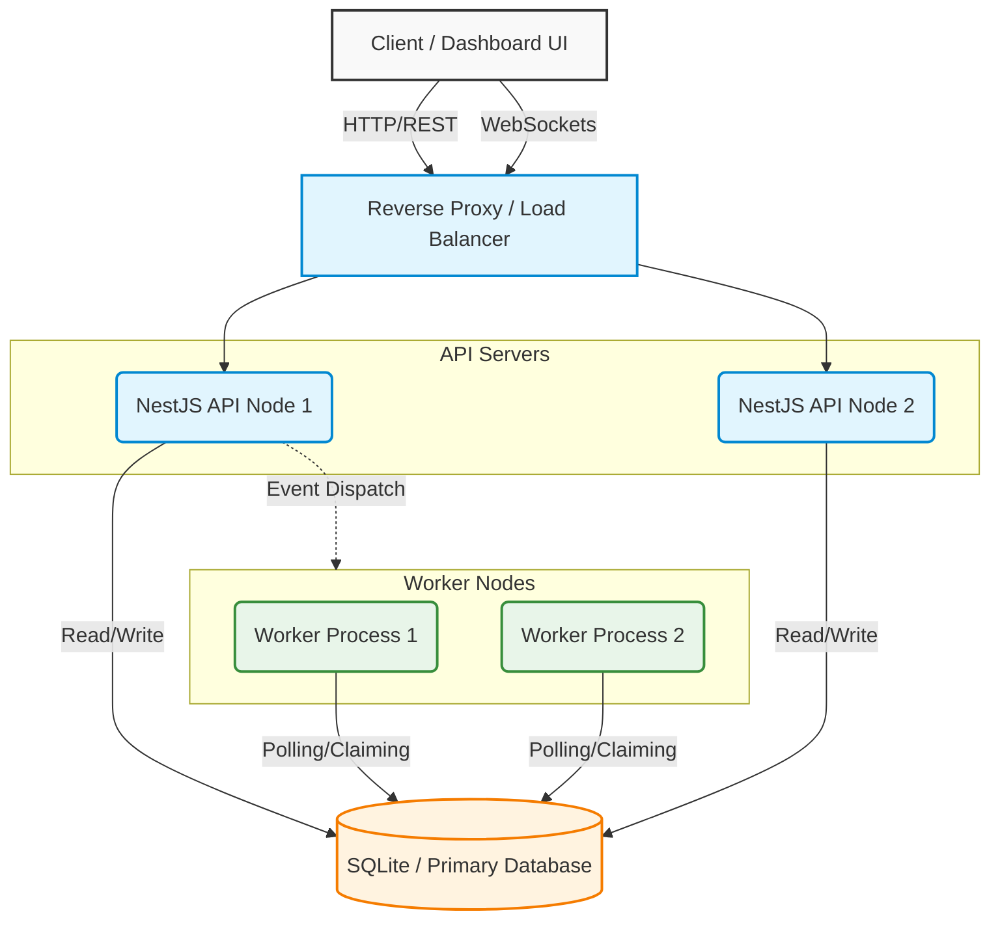

# Architecture

The Job Scheduler platform is designed as a distributed, scalable system with distinct separation of concerns between the API tier, Worker tier, and the Frontend UI.

## High-Level Architecture Diagram

## Component Overview

### 1. Dashboard UI (Frontend)
A Single Page Application (SPA) built with pure HTML, CSS, and Vanilla JavaScript. It communicates with the API via REST endpoints. The UI polls the API to fetch real-time metrics, queue backlogs, and worker heartbeats.

### 2. NestJS API (Backend)
The core REST API built with NestJS. It handles:
- Authentication & Authorization (JWT-based).
- Project and Queue management.
- Job ingestion (Immediate, Delayed, Scheduled).
- Reporting and statistics (Job Throughput, Queue status).

### 3. Worker Processes
Standalone Node.js processes that continuously poll the database for `queued` or `scheduled` jobs that are ready to run. 
- Workers use transaction-level locking to **claim** jobs securely, preventing race conditions.
- They execute the jobs, handle retries based on the assigned `RetryPolicy`, and write execution logs.
- They emit heartbeats to the database every few seconds so the API can track active workers.

### 4. Database (SQLite via Prisma)
The central source of truth for the entire system. It stores user accounts, projects, queues, jobs, worker heartbeats, and logs. While SQLite is used for simplicity in this implementation, the Prisma ORM allows seamless migration to PostgreSQL or MySQL for production scale.
