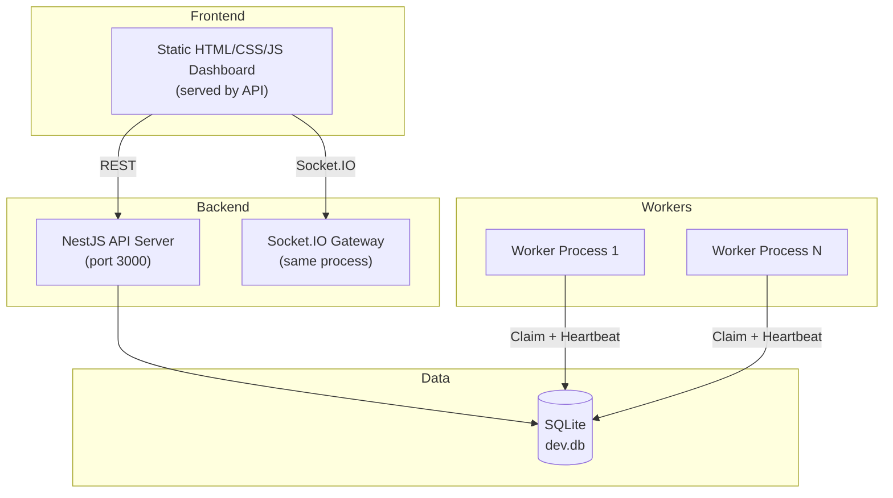

# Architecture

```mermaid
graph TB
    subgraph Frontend
        WEB["Static HTML/CSS/JS Dashboard<br/>(served by API)"]
    end
    subgraph Backend
        API["NestJS API Server<br/>(port 3000)"]
        WS["Socket.IO Gateway<br/>(same process)"]
    end
    subgraph Workers
        W1["Worker Process 1"]
        W2["Worker Process N"]
    end
    subgraph Data
        DB[("SQLite<br/>dev.db")]
    end

    WEB -->|REST| API
    WEB -->|Socket.IO| WS
    API --> DB
    W1 -->|Claim + Heartbeat| DB
    W2 -->|Claim + Heartbeat| DB
```

The system uses a shared SQLite database for both state management and atomic claiming. Workers poll the database and use transactions to claim jobs.
