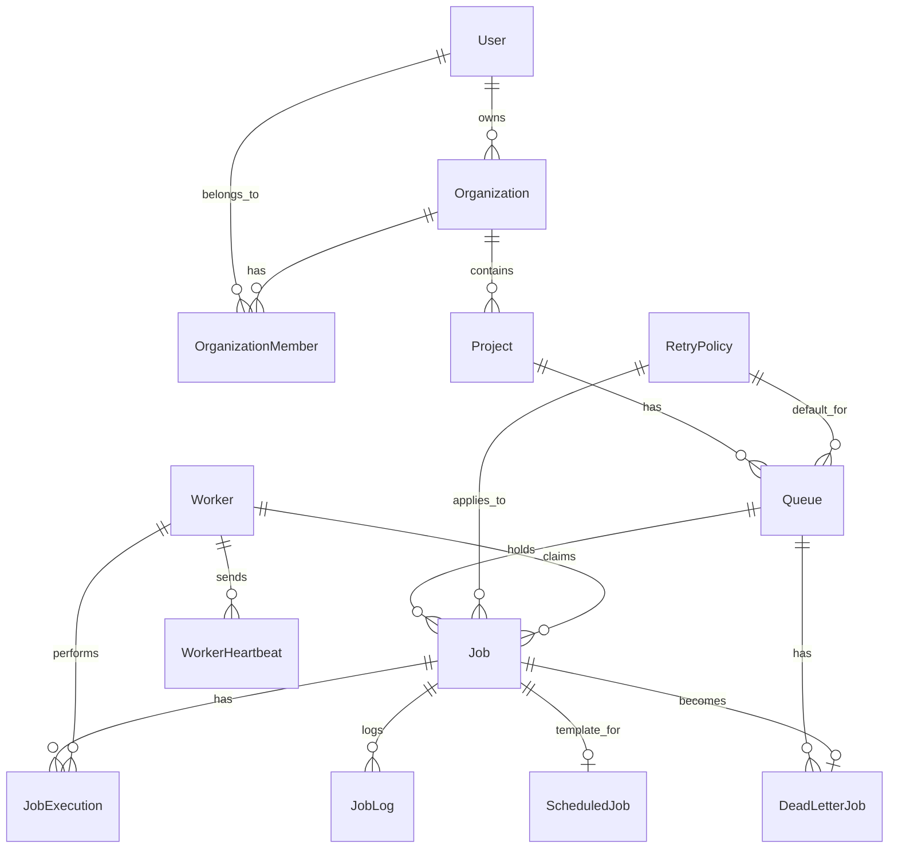

# Entity Relationship Diagram

```mermaid
erDiagram
    User ||--o{ Organization : owns
    User ||--o{ OrganizationMember : belongs_to
    Organization ||--o{ OrganizationMember : has
    Organization ||--o{ Project : contains
    Project ||--o{ Queue : has
    Queue ||--o{ Job : holds
    Queue ||--o{ DeadLetterJob : has
    RetryPolicy ||--o{ Queue : default_for
    RetryPolicy ||--o{ Job : applies_to
    Job ||--o{ JobExecution : has
    Job ||--o{ JobLog : logs
    Job ||--o| ScheduledJob : template_for
    Job ||--o| DeadLetterJob : becomes
    Worker ||--o{ Job : claims
    Worker ||--o{ JobExecution : performs
    Worker ||--o{ WorkerHeartbeat : sends
```
