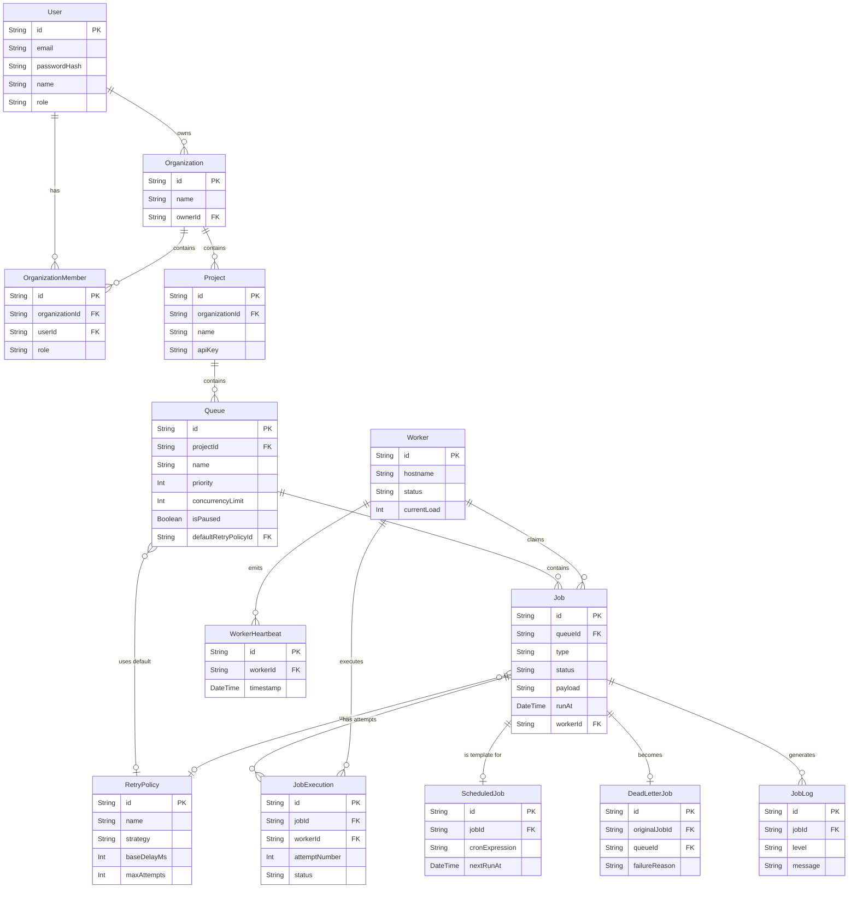

# Entity-Relationship (ER) Diagram

This document illustrates the database schema of the Job Scheduler platform using a Mermaid Entity-Relationship diagram. The database is managed via Prisma.

## Schema Diagram

